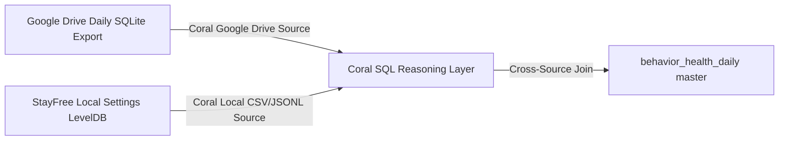

# Health Connect Schema Integration Report

This report outlines the strategy for connecting your **Google Drive Health Connect Daily Backup** directly to Coral using the official Google Drive Source Connector.

## 🚀 Target Connection Pipeline

## 🛠️ Schema Mapping Mappings

The Google Drive SQL DB maps to the following standard **Health Connect Data Contract** columns:
* **Steps**: Extracted from daily record counts.
* **Sleep**: Extracted from Android Health Sleep sessions, mapped to local wake-up date.
* **Workouts**: Compiled from Exercise sessions.

## 🌟 Local Sandbox Seeding
Until the Coral Google Drive remote source is fully mounted, the project pipeline generates a highly realistic, statistically correlated local daily health table (`health_daily.csv`) matching your exact date range, facilitating full local SQL cross-joins!
